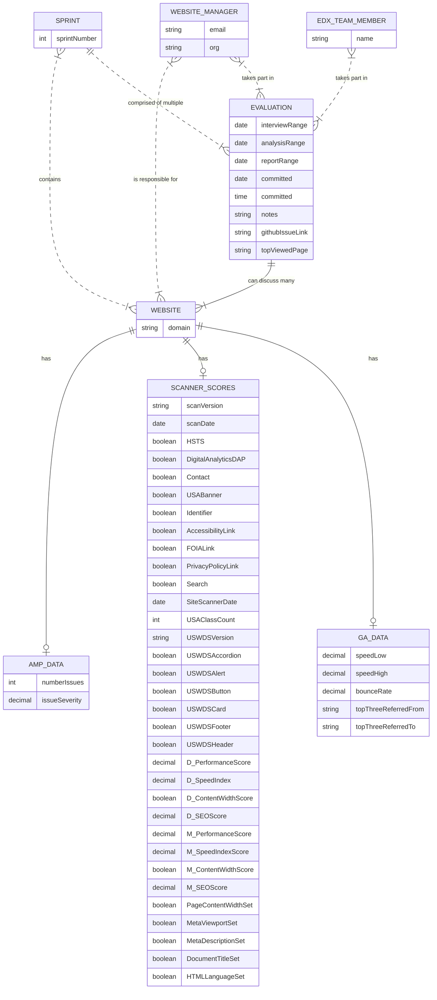

```mermaid 

erDiagram
    WEBSITE {
        string domain
    } 
    WEBSITE_MANAGER {
        string email
        string org
    }
    EDX_TEAM_MEMBER {
        string name
    }
    AMP_DATA {
        int numberIssues
        decimal issueSeverity
    }
    GA_DATA {
        decimal speedLow
        decimal speedHigh
        decimal bounceRate
        string topThreeReferredFrom
        string topThreeReferredTo
    }
    SPRINT {
        int sprintNumber
    }
    EVALUATION {
        date interviewRange
        date analysisRange
        date reportRange
        date committed
        time committed
        string notes
        string githubIssueLink
        string topViewedPage
    }
    SCANNER_SCORES {
        string scanVersion
        date scanDate
        boolean HSTS
        boolean DigitalAnalyticsDAP
        boolean Contact
        boolean USABanner
        boolean Identifier
        boolean AccessibilityLink
        boolean FOIALink
        boolean PrivacyPolicyLink
        boolean Search
        date SiteScannerDate
        int USAClassCount
        string USWDSVersion
        boolean USWDSAccordion
        boolean USWDSAlert
        boolean USWDSButton
        boolean USWDSCard
        boolean USWDSFooter
        boolean USWDSHeader
        decimal D_PerformanceScore
        decimal D_SpeedIndex
        boolean D_ContentWidthScore
        decimal D_SEOScore
        decimal M_PerformanceScore
        decimal M_SpeedIndexScore
        boolean M_ContentWidthScore
        decimal M_SEOScore
        boolean PageContentWidthSet
        boolean MetaViewportSet
        boolean MetaDescriptionSet
        boolean DocumentTitleSet
        boolean HTMLLanguageSet
    }

    SPRINT }|..|{ WEBSITE: contains
    SPRINT ||..|{ EVALUATION: "comprised of multiple"
    WEBSITE||--o| AMP_DATA : has
    WEBSITE||--o| SCANNER_SCORES: has
    WEBSITE||--o| GA_DATA: has
    EDX_TEAM_MEMBER}|..|{ EVALUATION: "takes part in"
    WEBSITE_MANAGER}|..|{ WEBSITE: "is responsible for"
    WEBSITE_MANAGER}|..|{ EVALUATION: "takes part in"
    EVALUATION ||--|{ WEBSITE: "can discuss many"
```
