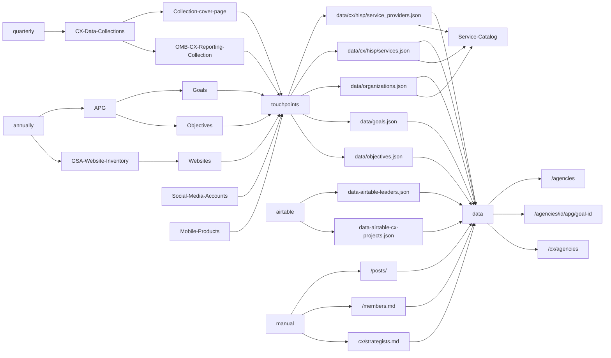

```mermaid
flowchart LR;

   quarterly-->CX-Data-Collections;
   annually-->APG;
   annually-->GSA-Website-Inventory;  

   CX-Data-Collections-->Collection-cover-page;
   CX-Data-Collections-->OMB-CX-Reporting-Collection;  
   Collection-cover-page-->touchpoints;
   OMB-CX-Reporting-Collection-->touchpoints;

   APG-->Goals;
   APG-->Objectives;
   GSA-Website-Inventory-->Websites;

   touchpoints-->data/cx/hisp/service_providers.json;
   touchpoints-->data/cx/hisp/services.json;
   touchpoints-->data/organizations.json;
   touchpoints-->data/goals.json;  
   touchpoints-->data/objectives.json;
   airtable-->data-airtable-leaders.json;
   airtable-->data-airtable-cx-projects.json;


   manual-->/posts/;
   /posts/-->data;

   manual-->/members.md;
   /members.md-->data;


   manual-->cx/strategists.md;
   cx/strategists.md-->data;

   data/cx/hisp/service_providers.json-->data;
   data/cx/hisp/services.json-->data;
   data/organizations.json-->data;
   data/goals.json-->data;  
   data/objectives.json-->data;
   data-airtable-leaders.json-->data;
   data-airtable-cx-projects.json-->data;

   data-->/agencies;
   data-->/agencies/id/apg/goal-id;
   data-->/cx/agencies;


   Websites-->touchpoints;  
   Social-Media-Accounts-->touchpoints;  
   Mobile-Products-->touchpoints;    

   Goals-->touchpoints;
   Objectives-->touchpoints;


   data/cx/hisp/service_providers.json-->Service-Catalog;
   data/cx/hisp/services.json-->Service-Catalog;
   data/organizations.json-->Service-Catalog;

```
